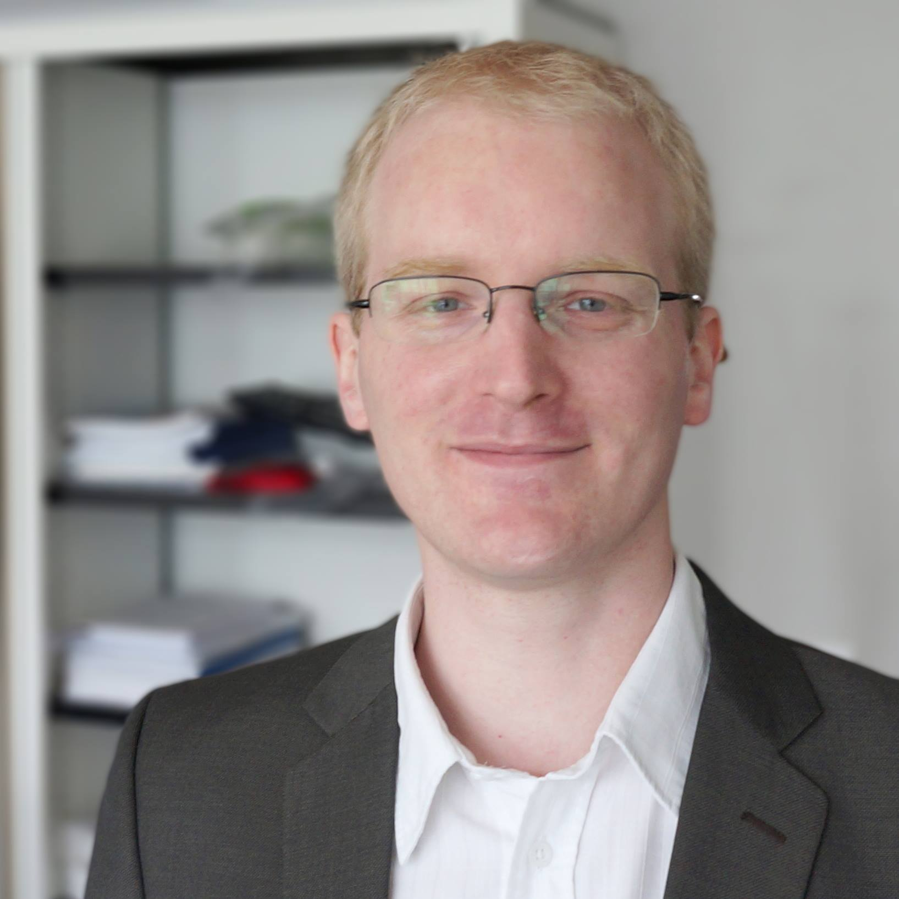

{:height="100px"}
I am a postdoctoral researcher at [ENSTA Paristech](https://www.ensta-paristech.fr/en) in [U2IS](http://u2is.ensta-paristech.fr/).

## Keywords

Set-membership Computation, validated approximation, validated numerical integration, interval analysis, affine arithmetic, constraint programing, operational research.

## Curriculum Vitae

